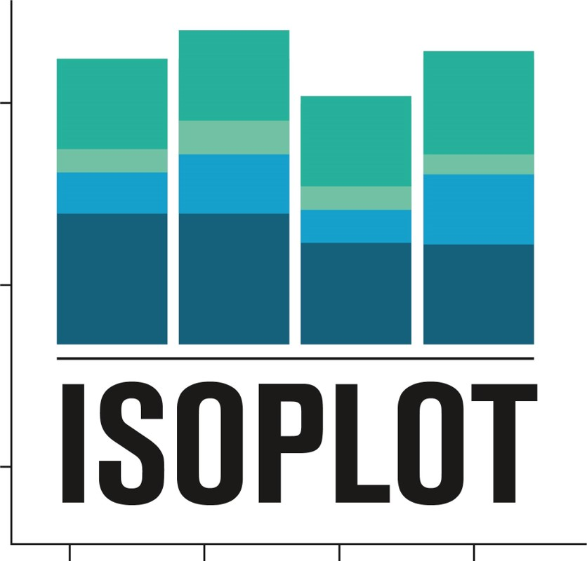

   
Data visualisation for mass spectrometry labelling experiments
********************************************************************************

Welcome to isoplot's documentation!
===================================

**Isoplot is a software for the visualisation of MS data from C13 labelling experiments.**
It takes as input corrected MS data from `IsoCor <https://isocor.readthedocs.io/en/latest/>`_
in csv or tsv format.
Isoplot outputs static and interactive plots that are then used for quality assessment,
biological interpretation, project reports, published papers and so forth.

It is one of the routine tools used on the `MetaToul platform
<https://www6.toulouse.inrae.fr/metatoul>`_.

The code is open-source, and available on `GitHub <https://www.github.com/llegregam/Isoplot/>`_ under a GPLv3 license .

.. rubric:: Key Features

* **Creation of static and interactive plots** (barplot, heatmap, clustermap, etc...)
* **Command-line interface**
* **Jupyter Notebook graphical interface** using ipywidgets
* **Open-source, free and easy to install** everywhere where Python 3 is available
* **Biologist-friendly**

The documentation relative to Isoplot's installation and usage can be found on `ReadTheDocs <https://isoplot2.readthedocs.io/>`_.

.. toctree::
   :maxdepth: 2
   :caption: Usage
   
   quickstart.rst
   tutorial.rst
   walkthrough.rst
   
.. toctree::
   :maxdepth: 2
   :caption: Miscellaneous
   
   definitions.rst
   reference.rst
   faq.rst
